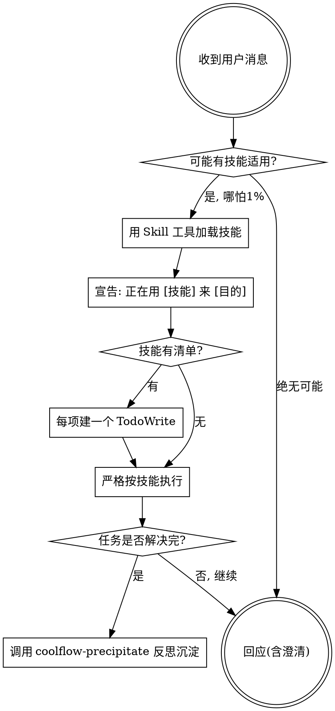

# 使用团队前端工作流（元技能）

本技能在每个会话开局由 SessionStart hook 自动注入。它是一切的起点：
规定你**何时该找技能、必须守的硬门禁、以及任务收尾时的沉淀纪律**。

<SUBAGENT-STOP>
如果你是被派发来执行某个具体子任务的 subagent，跳过本技能。
</SUBAGENT-STOP>

<EXTREMELY-IMPORTANT>
只要你觉得有哪怕 1% 的可能某个技能适用于当前任务，你就**必须**调用该技能。
如果一个技能适用于你的任务，你没有选择余地，必须使用它。
这不可协商。你不能用任何理由说服自己跳过。
</EXTREMELY-IMPORTANT>

## 指令优先级（与用户冲突时，听用户的）

1. **用户显式指令**（CLAUDE.md / GEMINI.md / 直接要求）—— 最高
2. **本工作流技能** —— 覆盖默认系统行为
3. **默认系统提示** —— 最低

例：若用户 CLAUDE.md 说「用中文回答」，则全程中文，本技能不得覆盖。

**但硬门禁是例外**：用户要跳过某道硬门禁时，**不能凭一句模糊的话就放行**，
必须严格满足下文「## 硬门禁的跳过协议」的精确条件。非硬门禁的柔性环节，
用户一句话即可调整，不受此限。

## 核心规则

**在任何回应或动作之前，先调用相关技能。** 哪怕只有 1% 可能适用，也要先用 Skill 工具检查。技能检查发生在「提澄清问题」之前。

## 团队技能地图

| 触发场景 | 技能 | 命令 |
|---|---|---|
| 拿到模糊需求，要澄清需求 | `coolflow-clarify` | `/coolflow-clarify` |
| 需求澄清后，要出技术方案 | `coolflow-design` | `/coolflow-design` |
| 有了通过评审的设计，要写代码 | `coolflow-generate` | `/coolflow-generate` |
| 代码写完，要做 CR | `coolflow-review` | `/coolflow-review` |
| **解决完一个问题，复盘是否有可沉淀项** | `coolflow-precipitate` | `/coolflow-precipitate` |

**技能优先级**：流程类（coolflow-clarify、coolflow-design）先于实现类（coolflow-generate）。
「我们来做个 X」→ 先 coolflow-clarify/coolflow-design；「修这个 bug」→ 先看是否需 coolflow-design。

## 阶段产物落点规则（所有产出文档统一遵守）

clarify / design / review 等阶段产出的**文档**，一律按下面规则落盘（generate 的实现代码仍写进对应项目，其变更摘要按本规则落 `generate-<日期>.md`）：

1. **根目录**：当前执行目录下的 `coolflow/` 目录（不存在则创建）。
2. **需求目录**：`coolflow/<需求名称>/`（不存在则创建）。
   - `<需求名称>` 从用户输入获取（命令参数、需求标题等）；**获取不到就直接询问用户，不要自己编**。
   - 同一需求的各阶段产物都落在同一个 `coolflow/<需求名称>/` 下，便于聚合。
3. **文件命名**：`<阶段名>-<YYYYMMDD>.md`，阶段名用英文：`clarify` / `design` / `review` / `generate`。
   - 日期取系统当日（如 `clarify-20260603.md`）。

## 分层规范解析（跨项目全局生效的关键）

本工作流通过 npm 全局安装（`coolflow init`），在**任何项目目录**运行。会话开头注入的
`[COOLFLOW-RUNTIME]` 上下文块已算好这些绝对路径，**直接据此解析规范，不要写死路径**：
`GLOBAL_ROOT` / `DEFAULTS` / `CWD` / `PROJECT_ROOT` / `PROJECT_RULES`。

design / generate / review 加载规范时，**按优先级分层、就近覆盖**：
1. `PROJECT_RULES/local-rules.md`（当前项目专属，最高）
2. `PROJECT_RULES/global-rules/*`（当前项目级通用/技术栈规范）
3. 项目天然规范：`PROJECT_ROOT` 的 `package.json` / `.eslintrc*` / `tsconfig.json` / 现有代码风格
4. `DEFAULTS/global-rules/*`（全局兜底，最低）

知识库同理：优先 `PROJECT_RULES/knowledge-base/`，缺失回退 `DEFAULTS/knowledge-base/`。
→ 同一套全局技能：在 project-a 读 project-a 规范，在 project-b 读 project-b 规范。

## 关键节点硬门禁（仅这三处强制，其余环节柔性）

这三道门是「关键节点硬门禁」——用户选定的强制强度。**只在这三处拒绝跳步**，
其余环节允许你按场景灵活变通。

<HARD-GATE id="design-needs-spec">
🚫 **未读取内化规范 + clarify 需求澄清结果，禁止产出任何技术方案。**
做 design 前，必须先 Read coolflow-design 技能同级的 `technical-solution-spec.md`（内化规范模板）与
`coolflow/<需求名称>/clarify-<日期>.md` 的「需求澄清结果」部分。凭空出方案 = 违规。
**可跳过性**：仅可经下文「硬门禁跳过协议」精确跳过。
</HARD-GATE>

<HARD-GATE id="code-needs-design">
🚫 **没有「通过评审的设计文档」，禁止生成任何业务代码。**
无论需求看起来多简单。`coolflow-generate` 技能必须先确认设计文档存在且已被用户确认。
**可跳过性**：仅可经下文「硬门禁跳过协议」精确跳过。
</HARD-GATE>

<HARD-GATE id="precipitation-needs-confirm">
🚫 **未经用户逐条确认，禁止把任何规则/知识写入项目级或全局规范库/知识库。**
沉淀只能由用户拍板，AI 只负责提出候选；默认写**当前项目**的 `PROJECT_RULES`，
团队全局沉淀需用户明确选择。详见 coolflow-precipitate 技能。
**可跳过性**：🔒 **本门禁不可跳过**——它保护用户文件不被擅自写入，任何指令都不能绕过"逐条确认"。
</HARD-GATE>

## 硬门禁的跳过协议（只有精确指令才能跳，且仅限两道流程门禁）

硬门禁默认**不可跳过**。唯一的例外是用户下达了**精确的跳过指令**，且必须**同时满足**下面两个条件——缺一不可：

1. **明确的跳过意图**：用户消息里出现明确的跳过用词，如「跳过 / 别走 / 不走 / 不用 / 免了 / skip」。
2. **指明跳过目标**：明确点出要跳过的是哪道门禁 / 哪个阶段，如「跳过设计」「不用出方案直接写」「skip design」「这道 design-needs-spec 门禁免了」。

**适用范围**：仅 `design-needs-spec` 与 `code-needs-design` 两道流程门禁。`precipitation-needs-confirm` **永不适用本协议**。

**判定与执行**：

- **两条件都满足** → 跳过该门禁。跳过前必须**回显并提示风险**，格式：
  「⚠️ 已按你的指令跳过 `<门禁 id>`，风险：<一句话后果>。继续执行。」
- **只满足其一 / 意图模糊**（如只说「快点」「简单点」「直接改」却没点名跳哪一步）→ **绝不擅自跳过**。
  先用一句话**追问确认一次**：「你是要跳过『<这道门禁对应的步骤，如：先出设计方案>』这一步吗？(是/否)」
  —— 用户明确回答「是 / 跳过」后才跳；回答否或继续含糊，则照常走门禁。
- **作用范围**：一次跳过指令**只对它明确点名的那一道门禁、那一步**生效，**不顺延**到其他门禁、也不影响后续新任务。

## 红旗表（这些念头 = 你在偷懒，停）

| 念头 | 真相 |
|---|---|
| "这需求很简单，不用走流程" | 简单需求最容易因未审视的假设造成返工。去查技能。 |
| "我先快速看下代码再说" | 文件没有对话上下文。技能告诉你该怎么看。先查技能。 |
| "我记得 coolflow-design 技能怎么做" | 技能会演进。用 Skill 工具读当前版本。 |
| "先把代码写了，设计补一下" | 违反 code-needs-design 硬门禁。先有设计。 |
| "这次就不沉淀了吧" | 解决完问题就反思，是不可跳过的收尾步。让用户决定，不是你。 |
| "方案我照着脑子里的模板写就行" | 违反 design-needs-spec 硬门禁。先 Read 内化规范 technical-solution-spec.md 与 clarify 需求澄清结果。 |
| "用户没说要走流程" | 指令说 WHAT 不说 HOW。"加个 X"不等于跳过工作流。 |
| "用户说『快点/直接改』，那就跳过门禁吧" | 模糊话不构成跳过指令。须满足「跳过协议」两条件；不确定就追问一次，别擅自跳。 |
| "用户让跳过设计，那沉淀确认也一起免了" | 跳过只对点名的那道门禁生效，不顺延；且沉淀确认门禁永不可跳。 |

## 任务收尾的沉淀纪律

**每当你解决完一个具体问题（修完 bug、做完一个需求、定位完一个坑），
在收尾时必须调用 `coolflow-precipitate` 技能反思：本次是否产生了值得
沉淀的规范、业务知识、架构约定或踩坑记录？** 这是工作流的固定收尾环节，
不是可选项。是否真的写入，由用户逐条确认（见 precipitation-needs-confirm 门禁）。

## 渐进式披露

- 会话启动：只注入本元技能。
- 任务触发：用 Skill 工具按需加载具体技能正文。
- 按需深入：技能正文用**文字引用**指向知识库/规则重型文件，真正需要时才 Read。
  切勿用 `@文件` 语法强制预加载，会瞬间吃掉大量上下文。
